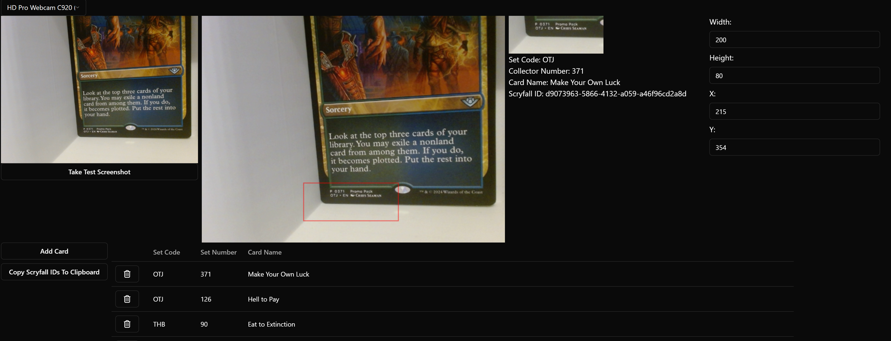

# MTG Scanner



MTG Scanner is a Tauri application built with React and TypeScript using Vite. The application allows users to scan and inventory Magic: The Gathering cards.

## Features

- Scan Magic: The Gathering cards using Gemini Multi Modal LLM.
- Easily export your scanned cards as Scryfall ids for import into manabox.

## Getting Started

### Prerequisites

Ensure you have the following installed on your machine:

- [Node.js](https://nodejs.org/) (LTS version recommended)
- [Rust and Cargo](https://www.rust-lang.org/tools/install)
- [Tauri prerequisites](https://tauri.app/v1/guides/getting-started/prerequisites/)

### Setup

1. Clone the repository:

   ```bash
   git clone https://github.com/yourusername/mtg-scanner.git
   cd mtg-scanner
   ```

2. Install dependencies:

   ```bash
   npm install
   ```

3. Configure the environment:

   - Copy the `env-template` file and rename it to `.env`:
     ```bash
     cp env-template .env
     ```
   - Open the `.env` file and fill in your Gemini API key.

4. Run the development server:

   ```bash
   npm run tauri dev
   ```

## Recommended IDE Setup

- [VS Code](https://code.visualstudio.com/)
  - Install the [Tauri](https://marketplace.visualstudio.com/items?itemName=tauri-apps.tauri-vscode) extension.
  - Install [rust-analyzer](https://marketplace.visualstudio.com/items?itemName=rust-lang.rust-analyzer).

## Contributing

Contributions are welcome! Please fork the repository and submit a pull request with your changes.

## License

This project is licensed under the [MIT License](./LICENSE).

